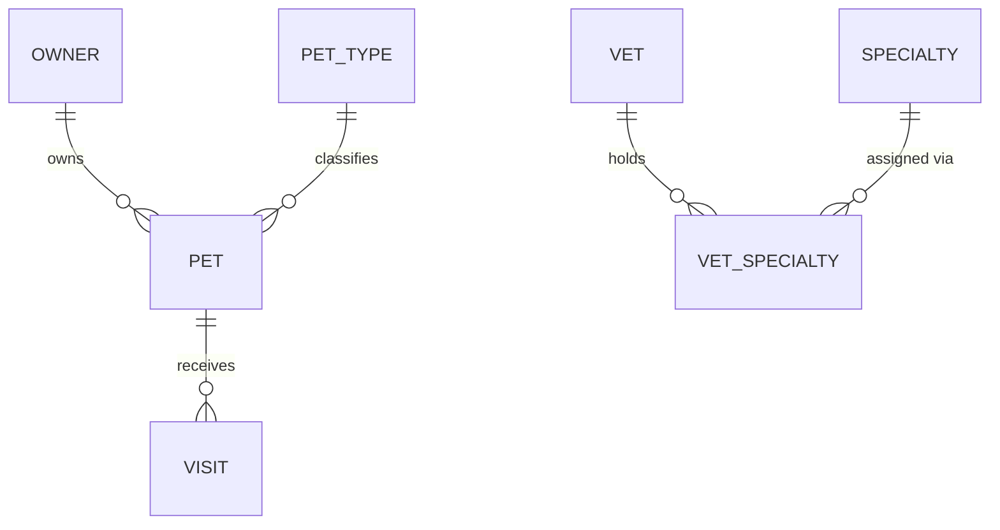

# Entity Model: PetClinic

## ER Diagram

---

## Entities

### OWNER

A clinic client who registers their pets for veterinary care.

| Attribute  | Description                    | Data Type | Length/Precision | Validation Rules      |
|------------|--------------------------------|-----------|------------------|-----------------------|
| id         | Unique owner identifier        | Integer   | —                | Primary Key, Sequence |
| first_name | Owner's given name             | String    | —                | Not Null              |
| last_name  | Owner's family name            | String    | —                | Not Null              |
| address    | Street address                 | String    | —                | Not Null              |
| city       | City of residence              | String    | —                | Not Null              |
| telephone  | Contact phone number           | String    | —                | Not Null              |

---

### PET

An animal belonging to an owner that receives veterinary care at the clinic.

| Attribute   | Description                          | Data Type | Length/Precision | Validation Rules                    |
|-------------|--------------------------------------|-----------|------------------|-------------------------------------|
| id          | Unique pet identifier                | Integer   | —                | Primary Key, Sequence               |
| name        | Pet's given name                     | String    | —                | Not Null                            |
| birth_date  | Pet's date of birth                  | Date      | —                | Not Null                            |
| owner_id    | Reference to the owning client       | Integer   | —                | Not Null, Foreign Key (OWNER.id)    |
| pet_type_id | Reference to the species/type        | Integer   | —                | Not Null, Foreign Key (PET_TYPE.id) |

---

### PET_TYPE

A reference classification for the species or breed category of a pet.

| Attribute | Description                      | Data Type | Length/Precision | Validation Rules      |
|-----------|----------------------------------|-----------|------------------|-----------------------|
| id        | Unique type identifier           | Integer   | —                | Primary Key, Sequence |
| name      | Display name of the type         | String    | —                | Not Null              |

---

### VISIT

A recorded clinic appointment for a pet, with date and staff notes.

| Attribute   | Description                          | Data Type | Length/Precision | Validation Rules                 |
|-------------|--------------------------------------|-----------|------------------|----------------------------------|
| id          | Unique visit identifier              | Integer   | —                | Primary Key, Sequence            |
| visit_date  | Date of the clinic visit             | Date      | —                | Not Null                         |
| description | Reason for the visit or staff notes  | String    | —                | Not Null                         |
| pet_id      | Reference to the pet that was seen   | Integer   | —                | Not Null, Foreign Key (PET.id)   |

---

### VET

A staff veterinarian employed by the clinic.

| Attribute  | Description                     | Data Type | Length/Precision | Validation Rules      |
|------------|---------------------------------|-----------|------------------|-----------------------|
| id         | Unique vet identifier           | Integer   | —                | Primary Key, Sequence |
| first_name | Veterinarian's given name       | String    | —                | Not Null              |
| last_name  | Veterinarian's family name      | String    | —                | Not Null              |

---

### SPECIALTY

A medical specialization that a veterinarian can hold.

| Attribute | Description                       | Data Type | Length/Precision | Validation Rules      |
|-----------|-----------------------------------|-----------|------------------|-----------------------|
| id        | Unique specialty identifier       | Integer   | —                | Primary Key, Sequence |
| name      | Display name of the specialty     | String    | —                | Not Null              |

---

### VET_SPECIALTY

A join record linking a veterinarian to one of their medical specialties.

| Attribute    | Description                              | Data Type | Length/Precision | Validation Rules                        |
|--------------|------------------------------------------|-----------|------------------|-----------------------------------------|
| vet_id       | Reference to the veterinarian            | Integer   | —                | Not Null, Foreign Key (VET.id)          |
| specialty_id | Reference to the specialty               | Integer   | —                | Not Null, Foreign Key (SPECIALTY.id)    |
